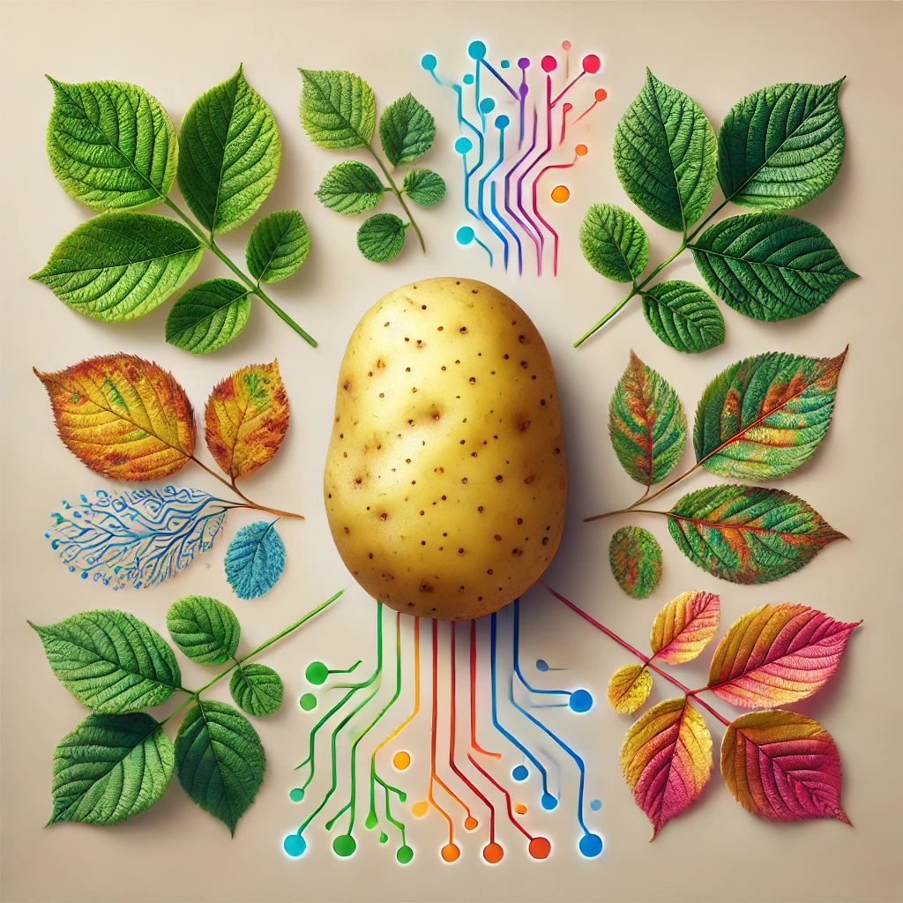

# 🍠 Potato Leaf Disease Classification 



## 📜 Project Overview

Agriculture is at the heart of global food security, and harnessing technology is key to managing crop health. This project utilizes advanced deep learning techniques to classify potato leaf diseases, such as Early Blight and Late Blight, using Convolutional Neural Networks (CNNs). By leveraging VGG and ResNet architectures, this project aims to enhance early and accurate disease detection, which is vital for protecting crop yields and ensuring food security.

---

## 📦 Datasets

The dataset used in this project is sourced from [Kaggle](https://www.kaggle.com/datasets/arjuntejaswi/plant-village)) and includes images of potato leaves categorized into:
- 🌿 **Healthy**
- 🌱 **Early Blight**
- 🍂 **Late Blight**

Each class contains a variety of images to ensure balanced representation and robust model training.

---

## 🛠️ Tools and Technologies Used

- **Data Analysis:** Python (Pandas, Numpy)
- **Machine Learning:** TensorFlow, Keras (for CNN implementation, VGG, ResNet)
- **Visualization:** Matplotlib, Seaborn
- **Version Control:** Git, GitHub

---

## 📥 Installation and Usage

**Prerequisites**

Make sure you have Python installed on your machine. Install the required libraries with:

```bash
# Install dependencies
pip install -r requirements.txt
```

**Running the Project**

```bash
# Clone the repository
git clone https://github.com/yourusername/potato-leaf-disease-classification.git
```

For detailed insights, refer to the [**Project Analysis Report**](analysis_report.ipynb), which includes data analysis, visualizations, and model development details.

[**requirements.txt**](requirements.txt): A list of required Python libraries.

---

## 🧑‍💻 Model Development and Evaluation

**1. Data Collection and Preprocessing**

- Utilized Kaggle images, categorized into three classes for balanced representation.
- Images were resized and rescaled for consistency.

**2. Data Augmentation and Normalization**

- Applied data augmentation techniques (random flips, rotations) to improve model robustness.
- Normalized pixel values to standardize the input data.

**3. Model Development**

- **Baseline CNN Model:** Developed a basic CNN as an initial evaluation.
- **VGG Architecture:** Leveraged a pre-trained VGG model for enhanced feature extraction through transfer learning.
- **ResNet Architecture:** Employed a pre-trained ResNet model to address deep network training challenges with skip connections.

**4. Model Training and Optimization**

- Used the Adam optimizer and categorical cross-entropy loss.
- Implemented early stopping to avoid overfitting and optimize computational efficiency.

**5. Model Evaluation**

- **Performance Metrics:** Compared accuracy and loss. VGG showed high accuracy with minimal overfitting, while ResNet had high accuracy but higher test loss.
- **Classification Report:** Provided precision, recall, F1-score, and support metrics.
- **Confusion Matrix:** Detailed visualization of true positives, false positives, and model errors.
- **Prediction Results:** Displayed correctly classified images with predicted labels and confidence scores.

---

### 🏆 Final Best Model: VGG

- **Exceptional Performance:** Achieved a high training accuracy of 99.62% and a test accuracy of 99.06%, demonstrating strong performance and effective generalization to new data with minimal overfitting.
  
- **Loss Analysis:** While the training loss is low at 0.0329, the slightly higher test loss of 0.0606 indicates minor overfitting and suggests opportunities for further optimization in model regularization and tuning.

---

## 🤝 Contributing

We welcome contributions! If you’d like to help improve this project, please:

1. Fork the repository.
2. Create a new branch (`git checkout -b feature/YourFeature`).
3. Make your changes and commit them (`git commit -am 'Add some feature'`).
4. Push to the branch (`git push origin feature/YourFeature`).
5. Create a new Pull Request.

Make sure your code is well-documented!

---

## 👥 Authors and Acknowledgment

This project was initiated and completed by **Puneetha Dharmapura Shrirama**. Special thanks to my mentor, **Jeevitha D S**, for her invaluable guidance and support. 🙌 Also, a big thank you to **Dhaval Patel** from Codebasics for his insightful tutorials and resources. 🚀📚

---

## 📝 License

This project is licensed under the MIT License. See the [LICENSE](LICENSE) file for details.
